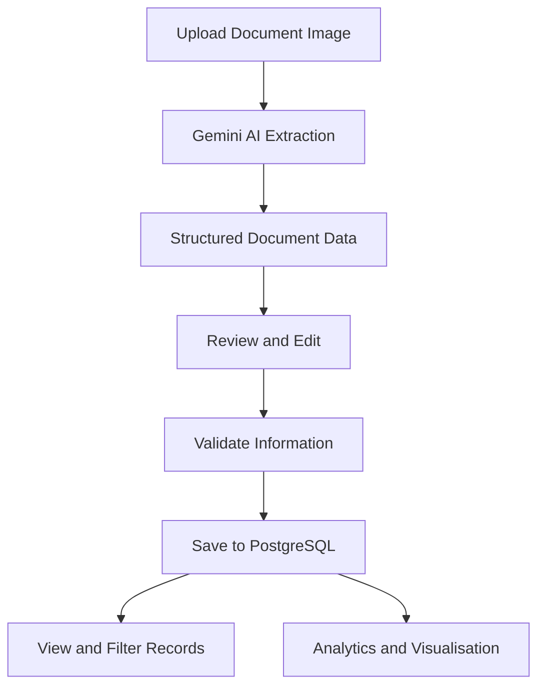

# DoDocu

### Making paper clutter as extinct as the Dodo.

**Snap. Extract. Extinct.**

DoDocu is an AI-powered document and receipt scanner that helps users digitise, organise, and analyse information from everyday documents. By combining Google's Gemini API with Python and a PostgreSQL database, DoDocu extracts relevant information from document images, allows users to review and correct the extracted data, and stores structured records for future reference and analysis.

Inspired by the dodo, a bird strongly associated with Mauritius, DoDocu aims to make paper clutter a thing of the past.

---

## Table of Contents

- [Overview](#overview)
- [Problem Statement](#problem-statement)
- [Key Features](#key-features)
- [Supported Documents](#supported-documents)
- [Application Workflow](#application-workflow)
- [Application Pages](#application-pages)
- [Technology Stack](#technology-stack)
- [Project Structure](#project-structure)
- [Database Design](#database-design)
- [Installation and Setup](#installation-and-setup)
- [Environment Variables](#environment-variables)
- [Running the Application Locally](#running-the-application-locally)
- [Running with Docker](#running-with-docker)
- [Deployment](#deployment)
- [Security and Data Handling](#security-and-data-handling)
- [Current Limitations](#current-limitations)
- [Future Enhancements](#future-enhancements)
- [Author](#author)

---

## Overview

DoDocu transforms document images into structured, searchable information.

Instead of manually recording details from receipts, invoices, tickets, and other documents, users can upload an image and let an AI model extract the relevant information. The extracted data can then be reviewed, edited, and saved to a PostgreSQL database.

The application also provides a centralised records interface and an analytics dashboard to help users explore their stored documents and understand their spending patterns.

### Objectives

- Reduce manual data entry when recording document information.
- Use AI to extract meaningful information from document images.
- Organise documents using document types and categories.
- Store structured information in a relational database.
- Enable users to retrieve and filter saved records.
- Provide visual insights through interactive analytics.
- Establish a foundation for more automated document-management workflows.

---

## Problem Statement

Receipts and other paper documents often contain information that is useful for expense tracking, record keeping, and future reference. However, manually recording this information can be time-consuming, and paper documents can easily be misplaced or forgotten.

DoDocu addresses these challenges by providing a workflow for digitising documents, extracting relevant information, organising records, and analysing the resulting data.

---

## Key Features

### 1. AI-Powered Document Extraction

- Upload document images in JPG, JPEG, or PNG format.
- Use Google's Gemini API to analyse the uploaded image.
- Extract relevant information into structured fields.
- Identify document types and assign categories where supported by the extraction workflow.
- Generate a concise document summary.

### 2. Review and Edit Extracted Data

- Review the information extracted by the AI model.
- Correct inaccurate or incomplete fields before saving.
- Validate relevant values, including dates and currency codes.
- Retain user control over the information stored in the database.

### 3. Structured Document Storage

- Save reviewed document information to a PostgreSQL database hosted on Neon.
- Use SQLAlchemy to interact with the database.
- Organise document information into relational database tables.
- Maintain a central repository of saved records.

### 4. Records Management

- View saved documents in a tabular interface.
- Browse stored document information.
- Filter records using available criteria, such as category and month.
- Retrieve relevant information without manually searching through paper documents.

### 5. Analytics and Visualisation

- View summary metrics for stored documents.
- Explore spending by category.
- Compare spending across merchants where the required data is available.
- Examine spending trends over time.
- Apply supported filters to focus on relevant records.

### 6. User-Friendly Interface

- Navigate through dedicated application pages.
- Use a consistent interface with DoDocu branding and the dodo-inspired application icon.
- Follow a clear workflow from document upload to record storage and analysis.

---

## Supported Documents

DoDocu is designed to handle a range of everyday documents, depending on the quality of the uploaded image and the extraction logic implemented.

| Document type    | Examples                                                             | Potential information to extract                                               |
| ---------------- | -------------------------------------------------------------------- | ------------------------------------------------------------------------------ |
| Receipts         | Grocery, restaurant, clothing, bakery, electronics and fuel receipts | Merchant, date, currency, subtotal, tax and total                              |
| Invoices         | Purchase invoices and service invoices                               | Supplier, invoice date, amounts and relevant details                           |
| Travel documents | Bus tickets and travel receipts                                      | Transport provider, journey information, date and fare                         |
| Other documents  | Notes and miscellaneous documents                                    | Document summary and relevant information supported by the extraction workflow |

The exact fields extracted depend on the document type, the available templates, and the information visible in the uploaded image.

For best results, upload a clear, readable image. If necessary, improve the image quality using a document-scanning application before uploading it.

---

## Application Workflow

DoDocu follows a document-processing pipeline that combines AI extraction, user validation, database storage, and analytics.

1. **Upload:** The user uploads a document image.
2. **Analyse:** The application sends the image to the Gemini-powered extraction service.
3. **Extract:** The AI model identifies relevant information and returns structured data.
4. **Review:** The application displays the extracted information for the user to inspect and edit.
5. **Validate:** The user checks the extracted values before saving.
6. **Save:** The application stores the reviewed information in the PostgreSQL database.
7. **Retrieve:** Saved documents become available through the records interface.
8. **Analyse:** The analytics module processes the stored records and presents metrics and visualisations.



---

## Application Pages

### 1. Home

The Home page introduces DoDocu and explains its purpose, key capabilities, target users, document-processing workflow, technology stack, and potential future developments.

### 2. Scan Document

The Scan Document page allows users to:

- Upload a supported document image.
- Trigger AI-powered information extraction.
- Review and edit the extracted fields.
- Check the relevant document details.
- Save the reviewed information to the database.

### 3. Records & Analytics

The Records & Analytics page provides access to saved document information and analytical insights.

Depending on the functionality enabled in the current application version, users can:

- Browse document records.
- Filter records by available criteria.
- View summary metrics.
- Explore category and merchant comparisons.
- Examine trends over time.

---

## Technology Stack

| Technology        | Purpose                                                       |
| ----------------- | ------------------------------------------------------------- |
| Python            | Core application programming language                         |
| Streamlit         | Web application interface and interactive components          |
| Google Gemini API | AI-powered document image analysis and information extraction |
| PostgreSQL        | Relational database for persistent document storage           |
| Neon              | Managed cloud PostgreSQL database hosting                     |
| SQLAlchemy        | Database connectivity, ORM and database operations            |
| Pandas            | Data transformation, tabular processing and analytics         |
| Plotly Express    | Interactive charts and data visualisation                     |
| Pillow (PIL)      | Image handling and processing                                 |
| Docker            | Application containerisation                                  |
| Git and GitHub    | Source control and code repository management                 |
| Render            | Cloud application deployment                                  |

---

## Project Structure

The project is organised into modules that separate the user interface, AI extraction, database operations, document templates, and analytics.

```text
dodocu_app/
│
├── app.py
├── gemini_service.py
├── document_templates.py
├── database.py
├── analytics.py
├── Dockerfile
├── .env
├── .gitignore
├── .dockerignore
├── requirements.txt
├── README.md
├── dodo_in_jungle.jpg
└── dodocu_icon.jpg
```


### Module Responsibilities

| File                    | Responsibility                                                                                                           |
| ----------------------- | ------------------------------------------------------------------------------------------------------------------------ |
| `app.py`                | Main Streamlit application, page navigation, document upload, review forms, records interface and analytics presentation |
| `gemini_service.py`     | Communication with the Gemini API and document information extraction                                                    |
| `database.py`           | Database configuration, initialisation, document persistence, retrieval and filtering                                    |
| `document_templates.py` | Document categories, templates and category-specific field definitions                                                   |
| `analytics.py`          | Conversion of database records into analytical data and calculation of metrics and chart datasets                        |
| `requirements.txt`      | Python dependencies required by the application                                                                          |
| `Dockerfile`            | Instructions for building the application container                                                                      |
| `.env`                  | Local environment variables and API/database credentials; must not be committed to Git                                   |
| `dodocu_icon.png`       | Application icon and branding asset                                                                                      |

---

## Database Design

DoDocu uses PostgreSQL for persistent storage, with Neon providing the hosted database and SQLAlchemy handling database operations.

The database is intended to separate general document information from additional details and any document-specific line items.

### Database Responsibilities

- Store core document information, including its type, category, merchant, date, currency, financial totals, and summary.
- Maintain relationships between a document and its associated details.
- Support the retrieval and filtering of saved documents.
- Supply structured data to the analytics module.

### Data Model

The logical data model includes the following entities:

| Entity           | Purpose                                                                                                 |
| ---------------- | ------------------------------------------------------------------------------------------------------- |
| Documents        | Stores the main information associated with each document                                               |
| Document details | Stores additional field names and values associated with a document, where implemented                  |
| Document items   | Stores individual line items associated with a document, where implemented                              |
| Categories       | Supports document classification and category-based organisation, where implemented as a separate table |

The precise table names and relationships depend on the current database implementation. Category-specific detail tables should only be documented as implemented once they exist in the database schema.

### Database Configuration

The application connects to PostgreSQL using a database connection URL supplied through an environment variable.

The database initialisation process is responsible for creating or verifying the required tables according to the application's database code.

**Important:** Updating the Python database models does not automatically remove obsolete tables from an existing Neon database. Schema migrations or a deliberate database reset may be required when changing the database design.

---

## Installation and Setup

Follow these steps to run DoDocu locally.

### Prerequisites

Ensure that the following are installed or available:

- Python
- Git
- A Google Gemini API key
- A PostgreSQL database, such as a Neon project
- Docker Desktop, if running the containerised version

### 1. Clone the Repository

Open a terminal and run:

```bash
git clone https://github.com/Deepshikha-4/dodocu-app.git
cd dodocu-app
```

### 2. Create a Virtual Environment

Create a virtual environment:

```bash
python -m venv .venv
```

Activate it on Windows:

```powershell
.venv\Scripts\Activate.ps1
```

If using Command Prompt instead of PowerShell:

```bat
.venv\Scripts\activate.bat
```

### 3. Install Dependencies

Install the required Python packages:

```bash
python -m pip install --upgrade pip
pip install -r requirements.txt
```

### 4. Configure Environment Variables

Create a `.env` file in the project root and add the required credentials.

See [Environment Variables](#environment-variables) for the configuration details.

### 5. Start the Application

Run:

```bash
streamlit run app.py
```

Streamlit will display the local application URL in the terminal. The default address is:

```text
http://localhost:8501
```

---

## Environment Variables

DoDocu requires credentials for the Gemini API and the PostgreSQL database.

Example `.env` configuration:

```dotenv
GEMINI_API_KEY=your_gemini_api_key
DATABASE_URL=your_postgresql_connection_url
```

Replace the example values with your actual credentials.

- `GEMINI_API_KEY` — API key used to access the Gemini model.
- `DATABASE_URL` — PostgreSQL connection URL for the Neon database.

Use the exact variable names expected by the current application code. If the database module uses a different environment variable name, update the example to match that implementation.

### Credential Safety

- Never commit `.env` to GitHub.
- Do not hardcode API keys or database passwords in Python files.
- Keep production credentials in your hosting provider's environment-variable settings.
- Do not expose database credentials in screenshots, logs, or public documentation.

---

## Running with Docker

Docker packages the application and its Python dependencies into a container, making the runtime environment more consistent across machines.

### 1. Build the Docker Image

Run the command from the directory containing the `Dockerfile`:

```bash
docker build -t dodocu:v1.0.0 .
```

### 2. Start the Container

If you have configured the application to load its environment variables from a local `.env` file, run:

```bash
docker run --name dodocu-v1 -p 8501:8501 --env-file .env dodocu:v1.0.0
```

Open the application at:

```text
http://localhost:8501
```

### 3. Manage the Container

Stop the container:

```bash
docker stop dodocu-v1
```

Restart the existing container:

```bash
docker start dodocu-v1
```

Remove the container after stopping it:

```bash
docker rm dodocu-v1
```

If a container with the same name already exists, remove the old container before creating another one with that name. Removing a container does not automatically remove its Docker image or delete records stored in the external Neon database.

---

## Deployment

DoDocu is configured for deployment using GitHub, Docker, and Render.

### Deployment Workflow

1. Update the application code locally.
2. Test the changes locally.
3. Build and test the Docker image when necessary.
4. Commit and push the changes to GitHub.
5. Allow the connected Render service to build and deploy the updated application, according to its deployment settings.
6. Check the deployed application and verify its database connectivity and core features.

### Project Links

- **GitHub repository:** [Deepshikha-4/dodocu-app](https://github.com/Deepshikha-4/dodocu-app)
- **Live application:** [https://dodocu-app.onrender.com](https://dodocu-app.onrender.com)

The live URL is the deployed application endpoint. Availability depends on the hosting service and its current deployment status.

---

## Security and Data Handling

DoDocu processes document images using an external AI service and stores structured records in a hosted database.

Users should therefore consider the sensitivity of the documents they upload.

Recommended practices include:

- Upload only documents they are authorised to process.
- Avoid uploading unnecessary personal or confidential information.
- Keep API keys and database credentials private.
- Restrict access to production database credentials.
- Use appropriate access controls and database permissions.
- Avoid logging sensitive document contents or credentials.

Document images are supplied to the Gemini service for AI processing. Users should review the relevant provider's data-handling policies before uploading sensitive documents.

---

## Current Limitations

DoDocu is an evolving application. Its capabilities depend on the current implementation and the quality of the supplied documents.

Known practical limitations include:

- **Image quality:** Blurry, rotated, damaged, or poorly lit images may produce inaccurate extraction results.
- **AI accuracy:** Extracted values may be incomplete or incorrect and should be reviewed before saving.
- **Document variability:** Different layouts and document formats may require additional extraction rules or templates.
- **Category-specific fields:** The fields available for a document depend on the implemented templates and database model.
- **Analytics quality:** Spending charts depend on correctly extracted and stored amounts, dates, currencies, and categories.
- **Currency handling:** Amounts in different currencies should not be treated as directly comparable without an appropriate conversion process.
- **Database evolution:** Changes to the data model may require database migrations and compatibility checks.

The application should be tested with representative documents before being relied upon for financial record keeping.

---

## Future Enhancements

Potential improvements include:

### 1. Expanded Document Templates

Introduce additional document-specific templates and structured fields for travel tickets, invoices, event tickets, handwritten notes, and other document types.

### 2. Improved Extraction and Validation

Improve the handling of missing values, inconsistent date formats, financial calculations, line items, and document classification.

### 3. Advanced Records Management

Expand filtering and search capabilities, provide more detailed record views, and support exporting selected records.

### 4. Richer Analytics

Introduce additional visualisations, more flexible date filters, category-level spending breakdowns, and clearer comparisons across currencies and time periods.

### 5. Email Integration

Explore integration with email services such as Gmail to identify relevant tickets, booking confirmations, receipts, and payment confirmations.

### 6. Calendar Integration

Explore automatically identifying events and bookings from relevant email messages and creating calendar entries, subject to user review and authorisation.

### 7. Automated Document Workflows

Develop a more connected workflow in which documents can be identified, extracted, categorised, stored, and linked to related activities with less manual intervention.

These are potential future developments rather than claims about functionality already available in the current application.

---

## Author

**DoDocu** is an AI/ML Ops project developed as part of an application development and deployment learning journey.

The project demonstrates the integration of AI-powered information extraction, Python application development, relational database management, data analytics, containerisation, version control, and cloud deployment.

**Project tagline:** *Making paper clutter as extinct as the Dodo.*

**Catchphrase:** *Snap. Extract. Extinct.*

